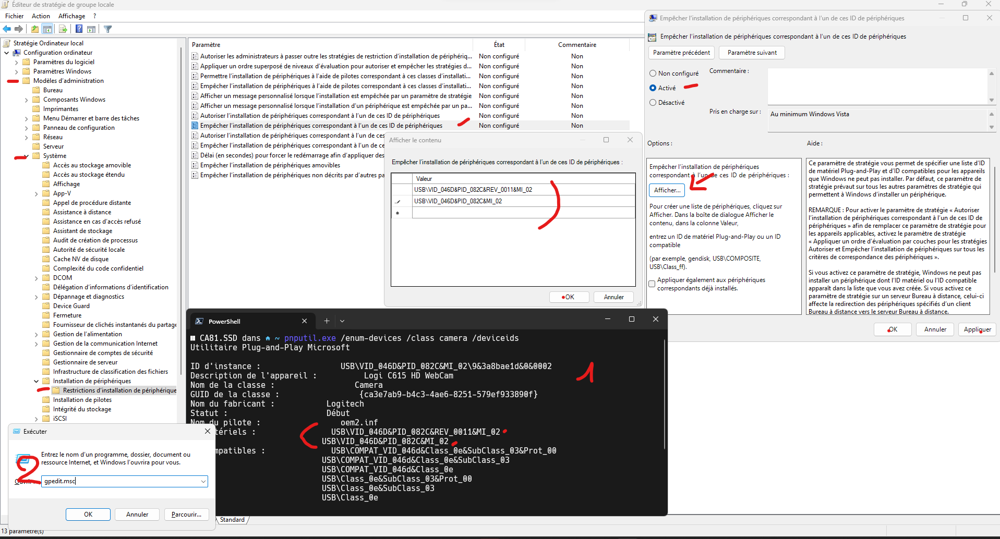

# Bloquer la mise a jour d'un ou plusieurs pilote specifique

## optionnel Pour les utilisateur d'une version familliale activer(installer) GPEDIT.MSC

        @echo off 
        pushd "%~dp0" 

        dir /b %SystemRoot%\servicing\Packages\Microsoft-Windows-GroupPolicy-ClientExtensions-Package~3*.mum >List.txt 
        dir /b %SystemRoot%\servicing\Packages\Microsoft-Windows-GroupPolicy-ClientTools-Package~3*.mum >>List.txt 

        for /f %%i in ('findstr /i . List.txt 2^>nul') do dism /online /norestart /add-package:"%SystemRoot%\servicing\Packages\%%i" 
        pause

## Remplacer la valeur HardwareIDs par les id du periphérique en question 
### Enregister en .reg

exemple avec les Id de l'image (commande précédentes)

    Windows Registry Editor Version 5.00

    [HKEY_LOCAL_MACHINE\SOFTWARE\Policies\Microsoft\Windows\DeviceInstall]

    [HKEY_LOCAL_MACHINE\SOFTWARE\Policies\Microsoft\Windows\DeviceInstall\Restrictions]
    "DenyDeviceIDs"=dword:00000001
    "DenyDeviceIDsRetroactive"=dword:00000000

    [HKEY_LOCAL_MACHINE\SOFTWARE\Policies\Microsoft\Windows\DeviceInstall\Restrictions\DenyDeviceIDs]
    "1"="USB\VID_046D&PID_082C&REV_0011&MI_02"
    "2"="USB\VID_046D&PID_082C&MI_02"

